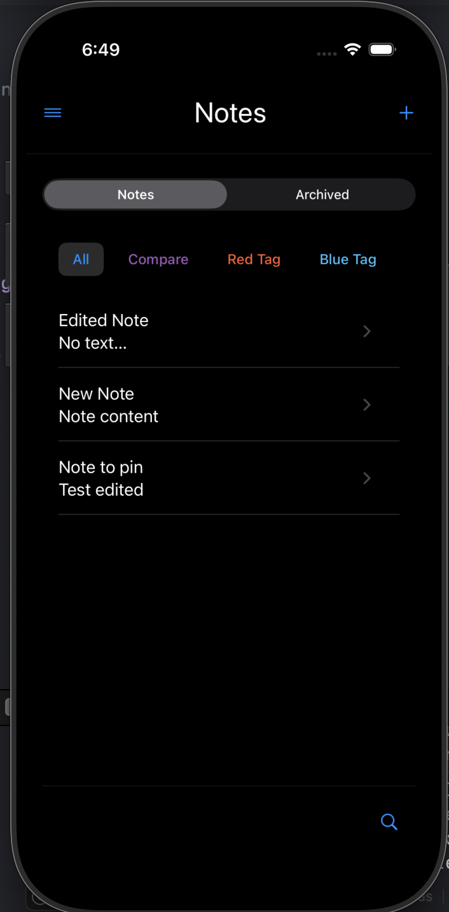
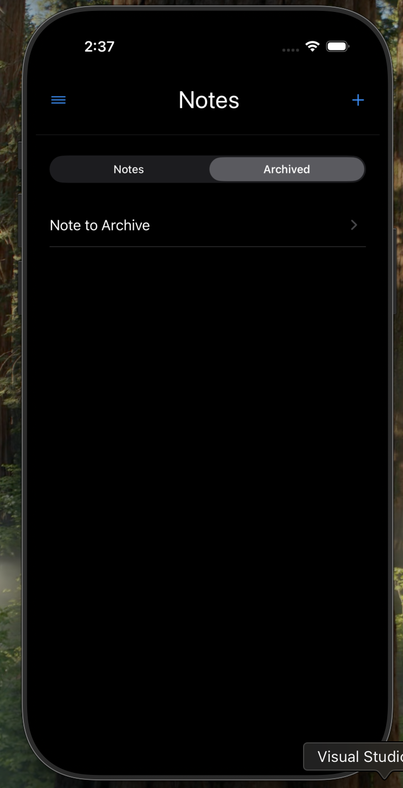
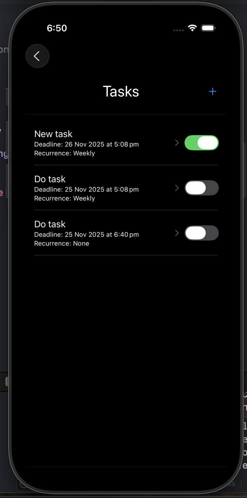
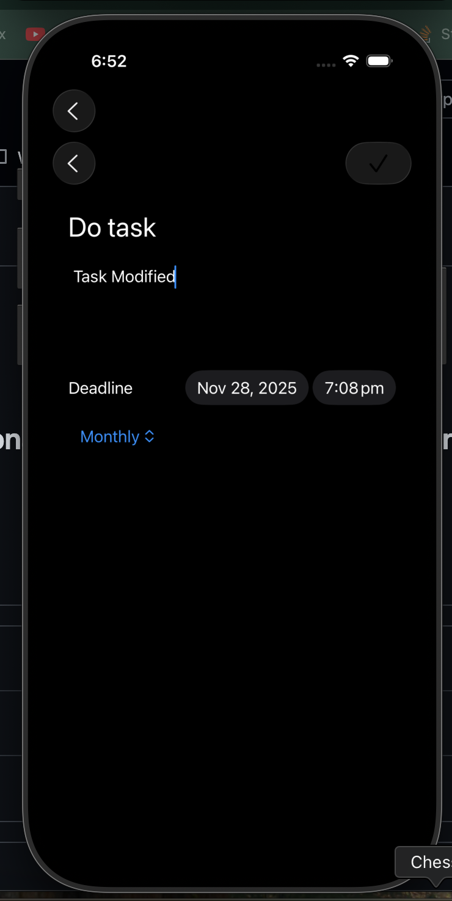

# NotesAI

Is a Note taking IOs app where as a user you have the posibility to **create, organize and track** your notes and tasks — with tags, calendar sync, themes, PDF export and more.

## Features
- ✅ Create, edit, delete notes  
- 🏷️ Create and delete tags  
- 🏷️ Assign one or multiple tags to each note  
- ✔️ Mark note as a task (toggle)  
- 👆 **Quick gestures**:  
  - Swipe to complete / un-complete task  
  - Swipe to delete task
  - Swipe to pin / un-pin note  
  - Swipe to delete note  
- 📂 **Separate views** for **Active** and **Completed** tasks  
- 📦 **Note archiving** (move out of sight without deleting)  
- 📅 Add tasks / events to **phone calendar**  
- 🔍 Basic search and filter by **text or tag**  
- 🌗 Theme system: **Light / Dark / Automatic**  
- 🔄 Recurrence: **daily / weekly / monthly**   
- 🎨 Tag management: **color, rename, merge duplicates**  
- 📄 Export notes as **PDF**   
- 📌 Pin important notes

## Tech Stack

## 📸 Screenshots

| Home | Archived notes | Completed Tasks | Active Tasks | Tags |
|------|--------------|-----------------|---------|---------------|
|  |  |  |  |  |

---

#### Contributing
Jimena Marin, Juan Pablo Monroy, Sofia Quintero

---
#### References
Jimena Marin

Readme: 
https://www.youtube.com/watch?v=DWFs6aqknqw
https://gprm.itsvg.in/
https://shields.io/

Toolbar:
https://developer.apple.com/documentation/swiftui/view/toolbar(content:)
Google search

swipeActions:
https://www.youtube.com/watch?v=LFrkGCFN_QE

Sidemenu:
https://www.youtube.com/watch?v=SikNH5E61gI&t=606s
https://www.youtube.com/watch?v=AXGrYI78hIo&t=112s

colorScheme:
https://developer.apple.com/documentation/swiftui/colorscheme
https://developer.apple.com/documentation/swiftui/view/preferredcolorscheme(_:)
https://medium.com/@dhavaljasoliya8/creating-a-dynamic-theme-switcher-light-dark-mode-in-swiftui-79d57427d392
https://livsycode.com/swiftui/swiftui-theme-dark-mode-light-mode-and-system-theme/
https://www.youtube.com/watch?v=nZNoJOtFNBw
https://stackoverflow.com/questions/58476048/implement-dark-mode-switch-in-swiftui-app
https://www.hackingwithswift.com/quick-start/swiftui/what-is-the-appstorage-property-wrapper
https://www.youtube.com/watch?v=zyuSUrfelw8

TextEditor:
https://www.youtube.com/watch?v=NiiYeoFYiXQ
https://artemnovichkov.com/blog/mastering-text-editor-in-swiftui
https://www.youtube.com/watch?v=AiSLtya25ac

---
